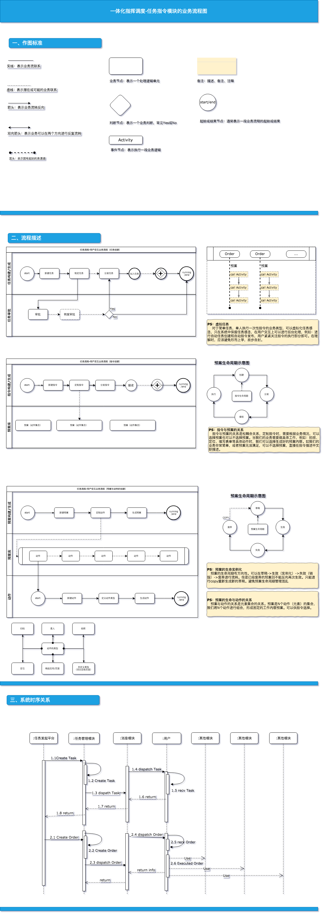

## 产品案例分享

1、 [**解放思想，利用人脸技术为一线民警减负。**](./product-idea-share)

2、--> **实事求是，打造公安行业的工作指令系统。**

3、**开放生态，采集一次、全警共享。**（待续）

## 实事求是，打造公安行业的工作指令系统

#### 痛点分析

公安业务中的诸多业务警种中，以指挥体系最为核心，而指挥主要体现在，以“看得见、呼得到、调的动”的扁平化指挥原则。

目前能够满足一线指挥系统中民警，进行可视化指挥调度、查看不同范围的警务人员分布情况、警用资源分布情况及巡逻路线。并同时可对其下发指令、提供指导，共享情报等诸多指挥作业的诉求，一致未得到妥善解决。大部分系统基于自己平台建立可资源可视化模块，有些系统基于自己的消息通讯平台建立了类似指令发送和接受。但都避不开**封闭、局限和严重的资源依赖**的弱点。指挥体系是公安业务中最严禁、复杂和庞大的一块。

经过与X市公安局共建数据警规平台，使我对警务指挥业务有了一定高度的认识。通过我的长时间持续一线调研。我抽离出几个比较突出的痛点。并尝试解决。

1. 缺乏一个协同案件处理的机制和平台。对于警务指令的发送、接收、处理、回告。缺乏一个灵活的、可移动、智能的和规范的信息化手段。
2. 对于工作流程的灵活与规范之间，没有一个能够轻巧、科学、规范和易于使用的用户移动应用。一线民警特别反感陈长、无效、呆板的传统工作流。
3. 管理层特别希望通过指令体系，进行下属的实时、在线管理，做到实时汇报、落地有声。

#### 解决方案

- **核心用户**：分局科、处级管理者，一线民警。

- **刚性需求**：随着法治社会的顶层设计逐步推进，作为执法机关的执法者，在执行警务任务时，需要有明确的操作规范，做到执法不犯法。即使是作为日常工作任务，也需要一个工作流程进行人员、时间、地点、内容、反馈、归档的移动信息化系统。

- **典型场景**：
  
  - 案件处理：对于110案件，接警民警接到报警电话一开始就需要一些列的流程处理。按照公安机关的执法要求，需要接警、出警、处警、回告、归档/转送。
  
  - 督查检查：对于督查干部对督查场所的不同，分不同级别的检查内容。需要根据内容逐项检查、记录、归档和处理。

- **产品概念**：一款移动数据规范。集任务、指令、动作为一体的通用任务指令解决方案。

- **竞争优势**： 目前公安行业还没有基于移动场景下的工作流解决方案。此方案属于创新领先型。对于其他类单一、特殊工作处理的系统而言。优点是不局限于单个业务，实时性、移动性、可配置性以及扩展性强。

作为一款指令系统。理论上的严禁是必须的。所有的业务要素和概念要经得起实际工作的检验。所以我花在很大一部分精力，放在了理论研究上。提出了三个概念：任务、指令和动作。三者的关系表示为:1...\*...\*。

1. **任务解决的核心问题，** 是处理人与人关系的问题。

是为任务的参与者提供成员关系。由任务成员、任务描述、任务期限等元素组成的业务形式，在系统中以任务的形态体现。

2. **指令解决的工作的内容问题。** 是处理人与工作的关系。

指令与任务模块是依附关系，指令必须在任务中发送，指令处 的核 问题是执 与执 的事件。 个指令具备完整的 命周期，从创建、接收、执行完成4个阶段。

3. **动作解决的事具体工作内容和流程的问题。** 是处理工作是否规范、内容是否灵活的问题。

指令预案(或称为动作)是指令执行的具体执内容，系统中将所有动作进行类型抽象。对于用户而言，单个动作是项具体的业务描述或规范描述，在系统内部对应为某个动作类型。业务要求指令必须有个动作(默认为 本动作)。

#### 方案特点

本方案的特点就在于，通过抽象出任务、指令和动作的感念后，其他的一切系统都是外部系统，这样保证了本系统既独立又可扩展，避免的庞大的系统，落地困难，形成纸上谈兵的局面。

1. 核心业务高内聚，最小MVP。不依赖第三方资源，保障快速落地。

2. 标准和开放的对外开放，持续精进。消息系统配合形成群任务、可以资源可视化系统配合称为可视化指挥

3. 高可配置性，经过不同的动作编排组合，适用不同的业务要求。

PD设计预览：

UI设计预览：

流程设计预览：

#### 上线运营

